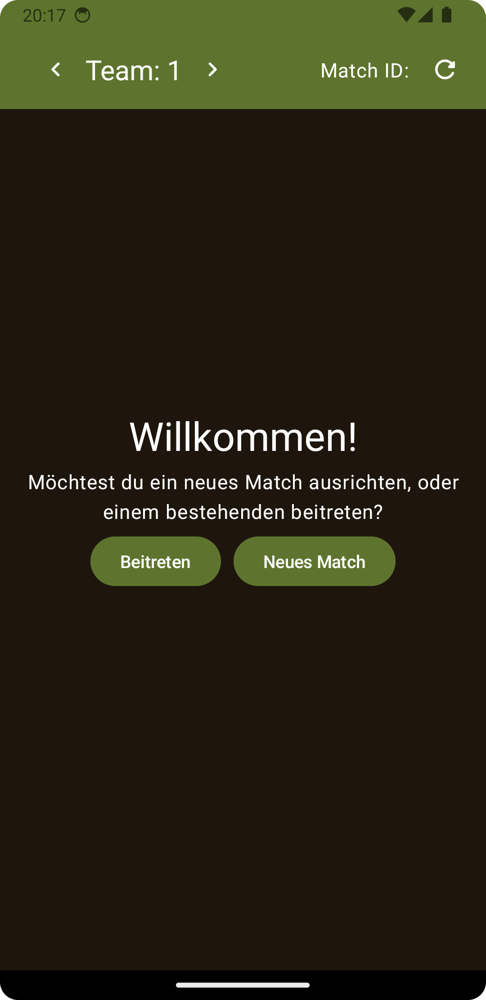
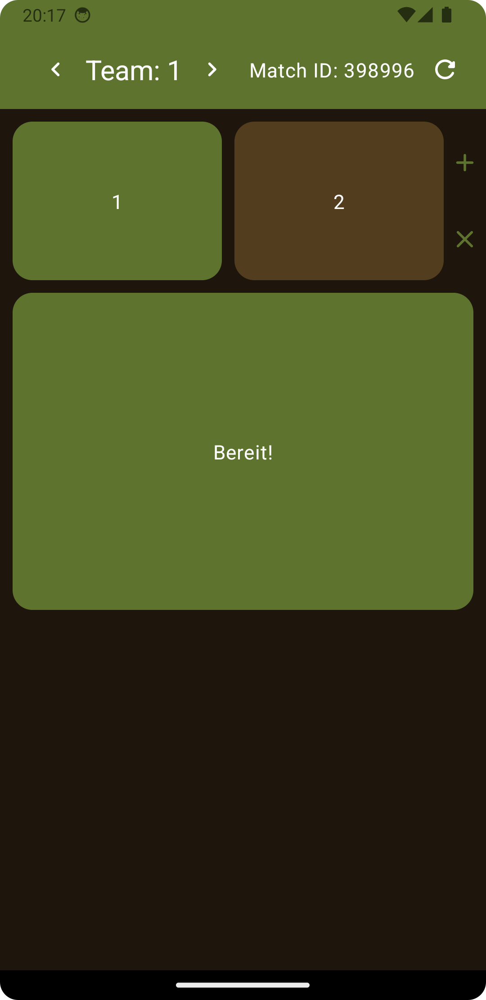
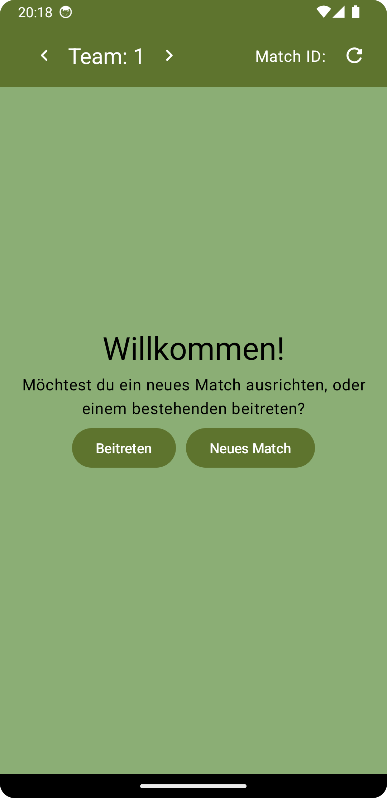
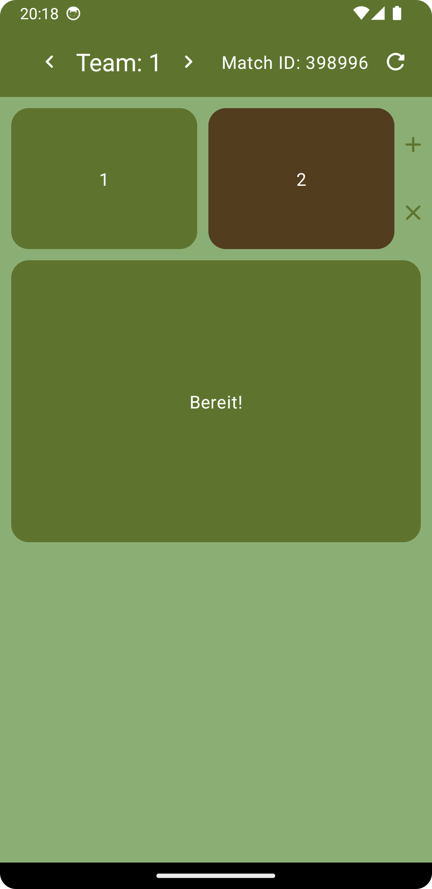

<a href="README.md">English</a> | <a href="README.de.md">Deutsch</a>

<h1>Paintball Notificator …damit du vor einem Match nicht mehr quer über den Platz brüllen musst.</h1>

> Simple App, um Bescheid zu geben, wenn alle Teams bereit sind.

## Screenshots
|  | | | |
|-|-|-|-|
|  |  |  |  | 

## Changelog
v1.0.0:
 - Material You Design
 - Dark Mode

v1.1.0:
 - Die Match ID kann jetzt auch direkt geteilt werden. Dadurch muss sie nicht mehr abgetippt werden.

v1.1.3:
 - Kleinere Verbesserungen

v1.1.4:
 - Landscape Modus deaktiviert

v1.2.0:
 - Header refactored

