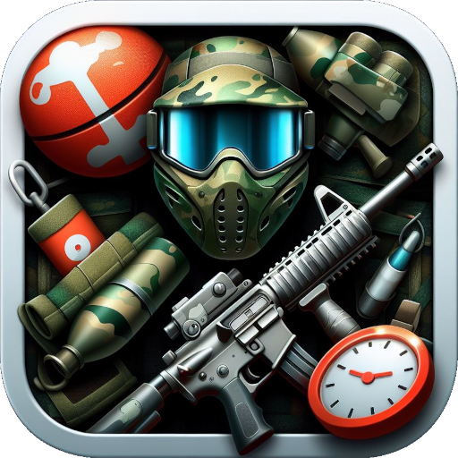
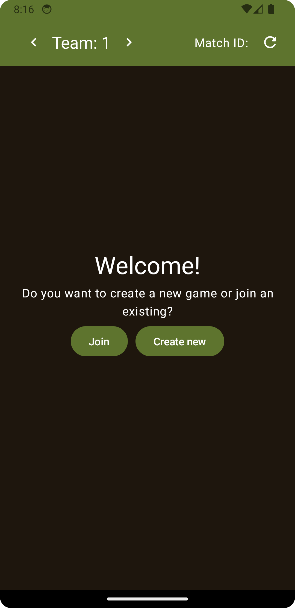
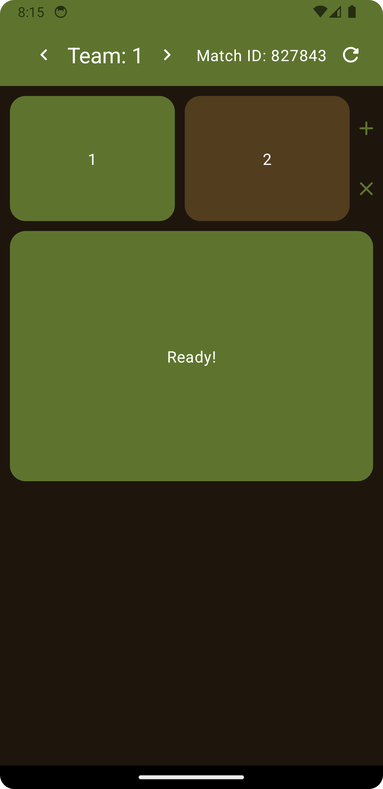
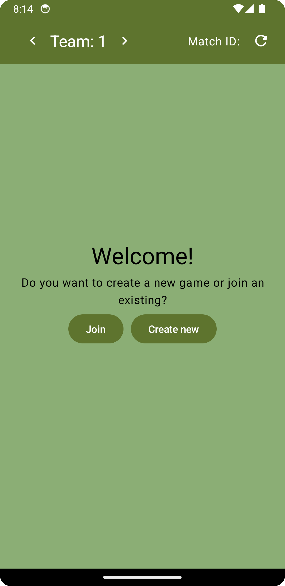
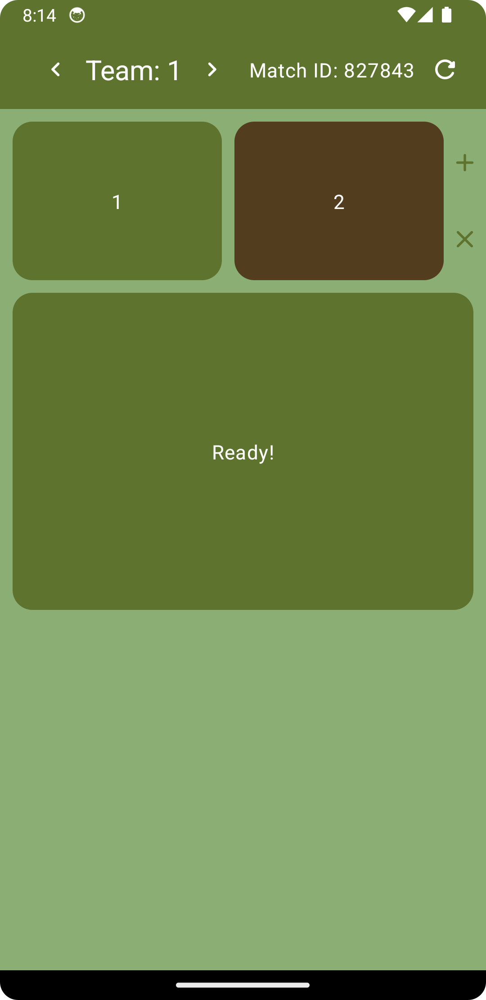

<a href="README.md">English</a> | <a href="README.de.md">Deutsch</a>

<h1>Paintball Notificator …so that you no longer have to shout across the pitch before a match.</h1>

> Simple app to let you know when all teams are ready.

## Screenshots
|  | | | |
|-|-|-|-|
|  |  |  |  | 

## Changelog
v1.0.0:
 - Material You design
 - Dark mode

v1.1.0:
 - You can share the match id now directly using the build in Android share sheet.

v1.1.3:
 - Minor improvements

v1.1.4:
 - Disabled landscape mode

v1.2.0:
 - Header refactored

v1.2.1:
 - Minor improvements

